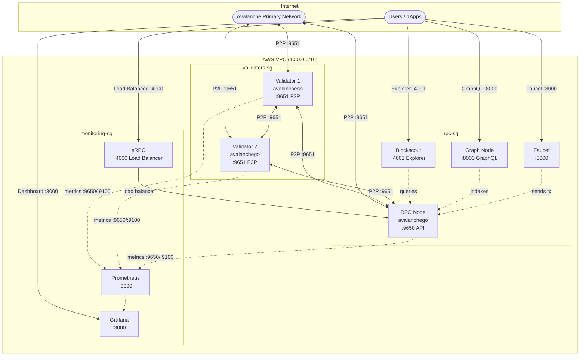

# Avalanche L1 Deploy

Deploy production-ready Avalanche L1 blockchains on AWS, GCP, or Azure.

```bash
make setup           # install tools (terraform, ansible, jq)
make infra           # create cloud VMs
make deploy          # install avalanchego
make create-l1       # create your L1 blockchain
make status          # check node health
make upgrade VERSION=1.12.0  # zero-downtime upgrades
make destroy         # tear down (stops billing!)
```

## What You Get

| Component | Default | Purpose |
|-----------|---------|---------|
| **Validators** | 2 | Block production, consensus |
| **RPC Node** | 1 | External queries, block explorer |
| **Monitoring** | 1 | Prometheus + Grafana dashboards |

Configure counts in `terraform/aws/terraform.tfvars`:
```hcl
validator_count = 3   # minimum 1 for testnet, 5+ recommended for mainnet
rpc_count       = 2   # scale based on traffic
```

**Optional Add-ons:**
- **Blockscout** - Block explorer for your L1
- **Faucet** - Token faucet for developers
- **The Graph Node** - Subgraph indexing for dApps
- **eRPC** - RPC load balancer with caching and failover
- **Safe Multisig** `[EXPERIMENTAL]` - Gnosis Safe infrastructure (see [SAFE.md](SAFE.md))

> **Warning:** Safe Multisig support is experimental and not production-ready. Known issues include transaction indexing delays, Docker container restarts, and HTTPS certificate management. Use at your own risk.

## Architecture



**4 EC2 Instances:**
| Instance | Security Group | Purpose |
|----------|---------------|---------|
| Validator 1 | validators-sg | Block production, consensus |
| Validator 2 | validators-sg | Block production, consensus |
| RPC Node | rpc-sg | API queries, Blockscout explorer |
| Monitoring | monitoring-sg | Prometheus, Grafana dashboards |

## Quick Start (AWS)

### Prerequisites

```bash
brew install terraform ansible awscli jq go
```

> **Note:** Building `create-l1` requires access to `github.com/ava-labs/platform-cli` (private repo).

### 1. Configure AWS & SSH

```bash
# AWS credentials
export AWS_ACCESS_KEY_ID="..."
export AWS_SECRET_ACCESS_KEY="..."

# Generate SSH key
ssh-keygen -t rsa -b 4096 -f ~/.ssh/avalanche-deploy -N ""
```

### 2. Configure Terraform

```bash
cd terraform/aws
cp terraform.tfvars.example terraform.tfvars
```

Edit `terraform.tfvars`:
```hcl
name_prefix    = "my-l1"
environment    = "fuji"
validator_count = 2
rpc_count       = 1
ssh_public_key  = "ssh-rsa AAAA..."
ssh_private_key_file = "~/.ssh/avalanche-deploy"
```

### 3. Deploy Infrastructure

```bash
terraform init && terraform apply
cd ../..
```

### 4. Install Avalanchego

```bash
make deploy
make status    # wait for "P:OK" on all nodes
```

### 5. Create Your L1

```bash
# Set your funded P-Chain private key
export AVALANCHE_PRIVATE_KEY="PrivateKey-ewoq..."

# Get validator IPs
export VALIDATORS=$(cd terraform/aws && terraform output -json validator_ips | jq -r 'join(",")')

# Create L1
make create-l1
./tools/create-l1/create-l1 \
  --network=fuji \
  --validators=$VALIDATORS \
  --chain-name=mychain \
  --output=l1.env

# For CI/CD, use --json for structured output:
# ./tools/create-l1/create-l1 --json --validators=$VALIDATORS
```

### 6. Configure Nodes

```bash
source l1.env
make configure-l1 SUBNET_ID=$SUBNET_ID CHAIN_ID=$CHAIN_ID
make status
```

Your L1 is now running.

---

## Operations

### Rolling Restart (Zero Downtime)

Restart nodes one at a time with health checks:

```bash
make rolling-restart
```

### Upgrade Avalanchego

Zero-downtime version upgrades (subnet-evm is bundled automatically):

```bash
make upgrade VERSION=1.12.0
```

### Health Checks

Comprehensive health checks on all nodes:

```bash
make health-checks
make health-checks CHAIN_ID=$CHAIN_ID  # include L1 status
```

---

## Optional Add-ons

### Monitoring

```bash
make monitoring
# Access: http://<monitoring-ip>:3000 (admin/admin)
```

### Blockscout (Block Explorer)

```bash
source l1.env
make deploy-blockscout CHAIN_ID=$CHAIN_ID EVM_CHAIN_ID=99999 CHAIN_NAME=$CHAIN_NAME
# Access: http://<rpc-ip>:4001
```

### Faucet (Token Distribution)

Deploy a faucet for developers to request test tokens:

```bash
source l1.env
make faucet CHAIN_ID=$CHAIN_ID EVM_CHAIN_ID=99999 FAUCET_KEY=0x...
# Access: http://<rpc-ip>:8000
```

> **Note:** The faucet wallet must be funded on your L1.

### The Graph Node (Subgraph Indexing)

Deploy The Graph for indexing blockchain data via GraphQL:

```bash
source l1.env
make graph-node CHAIN_ID=$CHAIN_ID NETWORK_NAME=my-l1
# GraphQL: http://<rpc-ip>:8000/subgraphs/name/<SUBGRAPH>
# Admin:   http://<rpc-ip>:8020
```

### eRPC (Load Balancer)

Deploy eRPC for RPC load balancing, caching, and automatic failover:

```bash
source l1.env
make erpc CHAIN_ID=$CHAIN_ID EVM_CHAIN_ID=99999
# RPC: http://<monitoring-ip>:4000 (use this in your dApps)
```

Features:
- Load balancing across all RPC nodes
- Automatic failover with circuit breaker
- Response caching
- Prometheus metrics

### Safe Multisig `[EXPERIMENTAL]`

> **Warning:** Safe is experimental and not production-ready.

See [SAFE.md](SAFE.md) for deploying Gnosis Safe infrastructure.

---

## Deployment Options

### Cloud VMs (Terraform + Ansible)

| Provider | Config | Command |
|----------|--------|---------|
| AWS | `terraform/aws/` | `make infra` (default) |
| GCP | `terraform/gcp/` | `make infra CLOUD=gcp` |
| Azure | `terraform/azure/` | `make infra CLOUD=azure` |

### Kubernetes (Helm Charts)

Deploy to existing K8s clusters using Helm charts in `kubernetes/helm/`:

```bash
cd kubernetes/helm
helm install validator ./avalanche-validator
helm install rpc ./avalanche-rpc
helm install monitoring ./monitoring
```

See [kubernetes/README.md](kubernetes/README.md) for detailed K8s deployment guide.

## Cost Estimate

Default instance types: `c6a.large` (2 vCPU, 4GB RAM), 500GB gp3 storage.

| Provider | Monthly (2 val + 1 RPC + monitoring) |
|----------|--------------------------------------|
| AWS | ~$300 |
| GCP | ~$270 |
| Azure | ~$350 |

*Costs vary by region. Use cloud pricing calculators for exact estimates.*

**Remember:** `make destroy` when done testing!

---

## Configuration Files

| File | Purpose |
|------|---------|
| `genesis.json` | L1 chain config (chainId, alloc, fees) |
| `validator-chain-config.json` | Validator settings (pruning on, fast sync) |
| `rpc-chain-config.json` | RPC settings (archive mode, debug APIs) |

### Genesis Configuration

Use the **[Genesis Builder](https://build.avax.network/tools/l1-toolbox/create-chain)** to generate your `genesis.json` with a visual interface, or edit manually.

Key settings:
- `chainId` - Unique EVM chain ID ([check availability](https://chainlist.org/))
- `feeConfig` - Gas limits and base fees
- `warpConfig` - Cross-chain messaging (Avalanche Interchain Messaging)
- `alloc` - Pre-funded addresses

---

## Commands Reference

### Infrastructure & Deployment

| Command | Description |
|---------|-------------|
| `make setup` | Install terraform, ansible, jq |
| `make infra` | Create cloud infrastructure |
| `make deploy` | Install avalanchego on nodes |
| `make create-l1` | Build the L1 creation tool |
| `make configure-l1` | Configure nodes for L1 |
| `make destroy` | Tear down infrastructure |

### Operations

| Command | Description |
|---------|-------------|
| `make status` | Check node sync status |
| `make health-checks` | Comprehensive health checks |
| `make rolling-restart` | Zero-downtime node restart |
| `make upgrade VERSION=x.y.z` | Upgrade avalanchego version |
| `make reset-l1` | Wipe L1 chain data for redeployment |
| `make logs` | View avalanchego logs |

### Developer Tools

| Command | Description |
|---------|-------------|
| `make monitoring` | Deploy Prometheus + Grafana |
| `make deploy-blockscout` | Deploy block explorer |
| `make faucet` | Deploy token faucet |
| `make graph-node` | Deploy The Graph Node |
| `make erpc` | Deploy eRPC load balancer |

### Safe Multisig (Experimental)

| Command | Description |
|---------|-------------|
| `make safe` | Deploy Safe infrastructure |
| `make safe-genesis` | Merge Safe contracts into genesis |
| `make reset-genesis` | Reset genesis.json to clean state |

---

## Getting a Funded P-Chain Address

You need AVAX on the P-Chain (Fuji testnet) to create an L1.

1. Install [Core Wallet](https://core.app/) and switch to Fuji testnet
2. Get test AVAX from the **[Builder Hub Faucet](https://build.avax.network/tools/faucet)**
3. Cross-chain transfer to P-Chain (Core Wallet → Portfolio → Cross-Chain)
4. Export your private key from Core Wallet

Supported key formats:
- `PrivateKey-ewoqjP7PxY4yr3iLTp...`
- `0x56289e99c94b6912bfc12adc...`

---

## Troubleshooting

| Problem | Solution |
|---------|----------|
| Ansible can't connect | Check SSH key in `ansible/inventory/aws_hosts` |
| Nodes not syncing | Run `make logs` to view errors |
| "insufficient funds" | Fund your P-Chain address on Fuji |
| "illegal name character" | Chain names must be alphanumeric (no hyphens) |
| Can't reach RPC | Validators don't expose 9650; use RPC node or SSH tunnel |
| "warp cannot be activated before Durango" | Add `"durangoTimestamp": 0` to genesis.json |

---

## Project Structure

```
.
├── terraform/              # Infrastructure as code
│   ├── aws/               # AWS config
│   ├── gcp/               # GCP config
│   └── azure/             # Azure config
├── ansible/               # Configuration management
│   ├── playbooks/         # Deployment & operations
│   │   ├── 01-deploy-nodes.yml
│   │   ├── 02-configure-l1.yml
│   │   ├── 03-setup-monitoring.yml
│   │   ├── 04-deploy-blockscout.yml
│   │   ├── 05-deploy-safe.yml
│   │   ├── 06-deploy-faucet.yml
│   │   ├── 07-deploy-graph-node.yml
│   │   ├── 08-deploy-erpc.yml
│   │   ├── rolling-restart.yml
│   │   ├── upgrade-nodes.yml
│   │   └── health-checks.yml
│   └── roles/             # avalanchego, prometheus, grafana,
│                          # blockscout, safe, faucet, graph_node, erpc
├── kubernetes/            # Helm charts for K8s deployment
├── tools/create-l1/       # Go tool for P-Chain transactions (--json output)
├── shared/                # Genesis templates, dashboards
└── scripts/               # Helper scripts
```

---

## Links

**Builder Hub Tools:**
- [Genesis Builder](https://build.avax.network/tools/l1-toolbox/create-chain) - Generate genesis.json
- [Fuji Faucet](https://build.avax.network/tools/faucet) - Get test AVAX

**Documentation:**
- [Avalanche Deploy Docs](https://build.avax.network/docs/tooling/avalanche-deploy)
- [Avalanche Docs](https://docs.avax.network/)
- [Chain List](https://chainlist.org/) - Check chain ID availability
