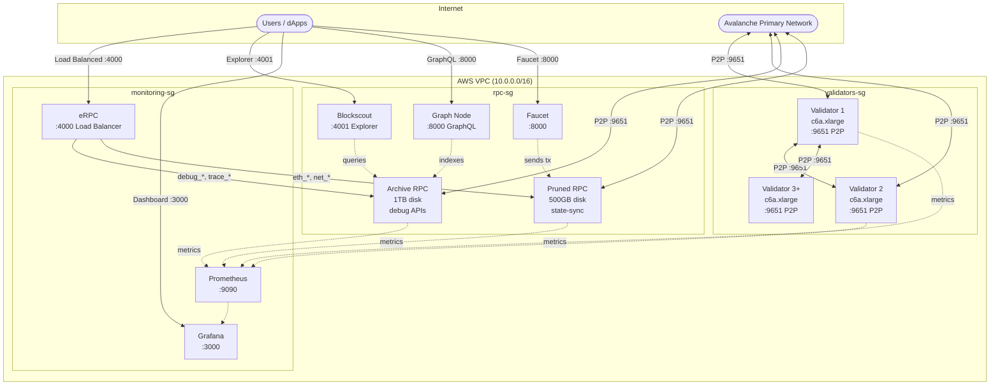
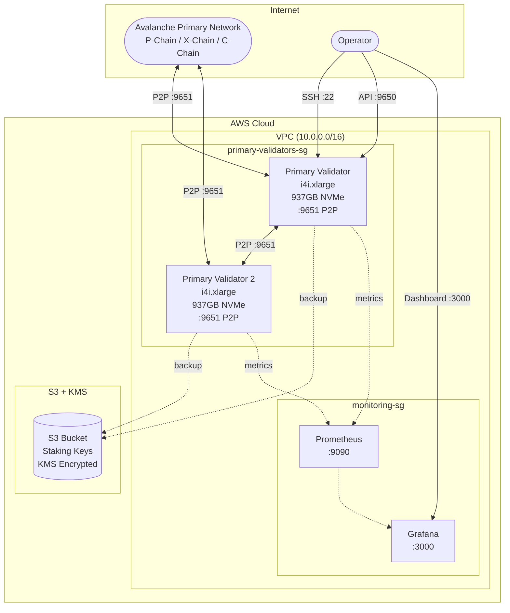
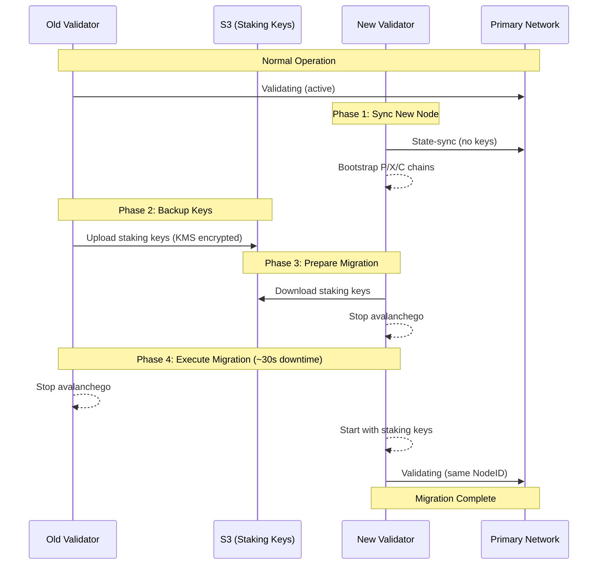

# Avalanche Deploy

Deploy production-ready **Avalanche L1 blockchains** or **Primary Network validators** on AWS, GCP, or Azure.

## L1 Blockchain Deployment

```bash
make setup           # install tools (terraform, ansible, jq)
make infra           # create cloud VMs
make deploy          # install avalanchego
make create-l1       # create your L1 blockchain
make status          # check node health
make destroy         # tear down (stops billing!)
```

## Primary Network Validator Deployment

```bash
make setup           # install tools
make primary-infra   # create validator infrastructure (i4i.xlarge + NVMe)
make primary-deploy  # install avalanchego for Primary Network
make primary-status  # check P/X/C chain sync
make backup-keys     # backup staking keys to S3
make destroy         # tear down (stops billing!)
```

## What You Get

### L1 Blockchain Infrastructure

| Component | Default | Purpose |
|-----------|---------|---------|
| **Validators** | 3 | Block production, consensus (c6a.xlarge) |
| **Archive RPC** | 1 | Full history, debug APIs, Blockscout (c6a.xlarge, 1TB) |
| **Pruned RPC** | 1 | Fast queries, state-sync, transactions (c6a.large, 500GB) |
| **Monitoring** | 1 | Prometheus + Grafana dashboards (t3.small) |
| **S3 Bucket** | 1 | Staking key backup with KMS encryption |

Configure counts in `terraform/aws/terraform.tfvars`:
```hcl
validator_count     = 5      # minimum 1 for testnet, 5+ recommended for mainnet
rpc_archive_count   = 1      # archive nodes for debug APIs and block explorer
rpc_pruned_count    = 1      # pruned nodes for transaction workloads
enable_staking_key_backup = true  # S3 backup for validator staking keys
```

### Primary Network Validators

| Component | Default | Purpose |
|-----------|---------|---------|
| **Primary Validators** | 0 | Avalanche Primary Network validation (i4i.xlarge, 937GB NVMe) |
| **S3 Bucket** | 1 | Staking key backup with KMS encryption |
| **Monitoring** | 1 | Prometheus + Grafana dashboards (t3.small) |

Configure in `terraform/aws/terraform.tfvars`:
```hcl
primary_validator_count = 1    # Number of Primary Network validators
enable_staking_key_backup = true  # S3 backup for staking keys
```

**Optional Add-ons:**
- **Blockscout** - Block explorer for your L1
- **Faucet** - Token faucet for developers
- **The Graph Node** - Subgraph indexing for dApps
- **eRPC** - RPC load balancer with caching and failover
- **Safe Multisig** `[EXPERIMENTAL]` - Gnosis Safe infrastructure (see [SAFE.md](SAFE.md))

> **Warning:** Safe Multisig support is experimental and not production-ready. Known issues include transaction indexing delays, Docker container restarts, and HTTPS certificate management. Use at your own risk.

## Architecture

### L1 Blockchain Architecture



### Primary Network Validator Architecture



**Primary Network Validator Migration (Near-Zero Downtime):**



**L1 Production Infrastructure (5 validators + 2 RPC):**
| Instance | Type | Disk | Purpose |
|----------|------|------|---------|
| L1 Validators (5x) | c6a.xlarge | 500GB EBS | Block production, consensus |
| Archive RPC | c6a.xlarge | 1TB EBS | Full history, debug APIs, Blockscout |
| Pruned RPC | c6a.large | 500GB EBS | State-sync, transaction workloads |
| Monitoring | t3.small | 50GB EBS | Prometheus, Grafana, eRPC |
| S3 Bucket | - | - | Staking key backup (KMS encrypted) |

**Primary Network Validator Infrastructure:**
| Instance | Type | Disk | Purpose |
|----------|------|------|---------|
| Primary Validator | i4i.xlarge | 937GB NVMe | Primary Network validation (P/X/C chains) |
| S3 Bucket | - | - | Staking key backup (KMS encrypted) |
| Monitoring | t3.small | 50GB EBS | Prometheus, Grafana |

**RPC Node Types (L1):**
| Type | APIs | Pruning | State-Sync | Use Case |
|------|------|---------|------------|----------|
| Archive | Full (incl. debug/trace) | Disabled | Disabled | Block explorer, debugging, historical queries |
| Pruned | Standard (eth, net, web3) | Enabled | Enabled | Transaction submission, latest state queries |

## Quick Start (AWS)

### Prerequisites

```bash
brew install terraform ansible awscli jq go
```

> **Note:** Building `create-l1` requires access to `github.com/ava-labs/platform-cli` (private repo).

### 1. Configure AWS & SSH

```bash
# AWS credentials
export AWS_ACCESS_KEY_ID="..."
export AWS_SECRET_ACCESS_KEY="..."

# Generate SSH key
ssh-keygen -t rsa -b 4096 -f ~/.ssh/avalanche-deploy -N ""
```

### 2. Configure Terraform

```bash
cd terraform/aws
cp terraform.tfvars.example terraform.tfvars
```

Edit `terraform.tfvars`:
```hcl
name_prefix       = "my-l1"
environment       = "fuji"
validator_count   = 5
rpc_archive_count = 1
rpc_pruned_count  = 1
ssh_public_key    = "ssh-rsa AAAA..."
ssh_private_key_file = "~/.ssh/avalanche-deploy"
```

### 3. Deploy Infrastructure

```bash
terraform init && terraform apply
cd ../..
```

### 4. Install Avalanchego

```bash
make deploy
make status    # wait for "P:OK" on all nodes
```

### 5. Create Your L1

```bash
# Set your funded P-Chain private key
export AVALANCHE_PRIVATE_KEY="PrivateKey-ewoq..."

# Get validator IPs
export VALIDATORS=$(cd terraform/aws && terraform output -json validator_ips | jq -r 'join(",")')

# Create L1
make create-l1
./tools/create-l1/create-l1 \
  --network=fuji \
  --validators=$VALIDATORS \
  --chain-name=mychain \
  --output=l1.env

# For CI/CD, use --json for structured output:
# ./tools/create-l1/create-l1 --json --validators=$VALIDATORS
```

### 6. Configure Nodes

```bash
source l1.env
make configure-l1 SUBNET_ID=$SUBNET_ID CHAIN_ID=$CHAIN_ID
make status
```

### 7. Initialize Validator Manager (Optional)

If your genesis includes a ValidatorManager proxy contract, initialize it:

```bash
# Requires foundry (forge/cast) and icm-contracts repo
# Install foundry: curl -L https://foundry.paradigm.xyz | bash && foundryup

# Set path to icm-contracts (clone from github.com/ava-labs/icm-contracts)
export ICM_CONTRACTS_PATH=~/code/icm-contracts

# Initialize the validator manager
source l1.env
make initialize-validator-manager \
  SUBNET_ID=$SUBNET_ID \
  CHAIN_ID=$CHAIN_ID \
  CONVERSION_TX=$CONVERSION_TX \
  PROXY_ADDRESS=0x... \
  EVM_CHAIN_ID=99999
```

This deploys the ValidatorManager implementation, upgrades the genesis proxy, initializes settings, and registers the initial validator set using a Warp message from the P-Chain.

Your L1 is now running.

### L1 Staking Key Management

Staking keys are automatically backed up to S3 during deployment (if `enable_staking_key_backup=true`).

```bash
# Backup all validator keys to S3
make backup-keys

# Backup specific validator
./scripts/backup-staking-keys.sh validator-1

# Restore keys to a new node
./scripts/restore-staking-keys.sh validator-1 10.0.1.50

# List backups
aws s3 ls s3://$(terraform -chdir=terraform/aws output -raw staking_keys_bucket)/
```

---

## Primary Network Validators

Deploy and operate Avalanche Primary Network validators with enterprise-grade features.

### Features

- **High-performance storage**: i4i.xlarge instances with 937GB NVMe
- **Staking key backup**: Automatic S3 backup with KMS encryption
- **Near-zero downtime migration**: Transfer validators to new instances
- **Full chain sync**: Complete P/X/C chain data (no partial sync)

### Quick Start

```bash
# 1. Create infrastructure
make primary-infra

# 2. Deploy validators
make primary-deploy NETWORK=fuji  # or mainnet

# 3. Wait for sync (2-4 hours for state-sync)
make primary-status

# 4. Register as validator on P-Chain (requires staking)
# Use Core Wallet or avalanche-cli

# 5. Verify keys are backed up
make backup-keys
```

### Database Snapshots

Create snapshots of synced nodes for faster bootstrapping:

```bash
# Create a snapshot from a synced validator
make create-snapshot NODE=primary-validator-1

# Create with custom name
make create-snapshot NODE=primary-validator-1 NAME=mainnet-2025-02

# List available snapshots
make list-snapshots

# Restore snapshot to a node
make restore-snapshot TARGET=migration-target
make restore-snapshot TARGET=migration-target SNAPSHOT=mainnet-2025-02
```

Snapshots are stored in S3 with KMS encryption. A **pruned mainnet snapshot is ~400GB** and restores in minutes vs hours for state sync.

### Validator Migration

Migrate a validator to a new instance with minimal downtime:

```bash
# 1. Add new instance to inventory as 'migration-target'

# 2. Prepare the new node
# Option A: Using snapshot (faster - minutes)
make prepare-migration NODE=migration-target SNAPSHOT=true

# Option B: Using state-sync (slower - hours)
make prepare-migration NODE=migration-target

# 3. Wait for sync to complete
./scripts/check-primary-sync.sh <new-node-ip>

# 4. Execute migration (~30s downtime)
make migrate-validator SOURCE=primary-validator-1 TARGET=migration-target
```

### Staking Key Management

```bash
# Backup all validator keys to S3
make backup-keys

# Restore keys to a specific node
make restore-keys SOURCE=primary-validator-1 TARGET_IP=10.0.1.50

# List backups
aws s3 ls s3://$(terraform -chdir=terraform/aws output -raw staking_keys_bucket)/
```

### Cost Estimate

| Component | Instance | Storage | Monthly (us-east-1) |
|-----------|----------|---------|---------------------|
| Primary Validator | i4i.xlarge | 937GB NVMe | ~$310 |
| S3 + KMS | - | ~1GB | ~$1 |
| **Total per validator** | | | **~$311/mo** |

---

## Operations

### Rolling Restart (Zero Downtime)

Restart nodes one at a time with health checks:

```bash
make rolling-restart
```

### Upgrade Avalanchego

Zero-downtime version upgrades (subnet-evm is bundled automatically):

```bash
make upgrade VERSION=1.12.0
```

### Health Checks

Comprehensive health checks on all nodes:

```bash
make health-checks
make health-checks CHAIN_ID=$CHAIN_ID  # include L1 status
```

---

## Optional Add-ons

### Monitoring

```bash
make monitoring
# Access: http://<monitoring-ip>:3000 (admin/admin)
```

### Blockscout (Block Explorer)

```bash
source l1.env
make deploy-blockscout CHAIN_ID=$CHAIN_ID EVM_CHAIN_ID=99999 CHAIN_NAME=$CHAIN_NAME
# Access: http://<archive-rpc-ip>:4001
```

> **Note:** Blockscout is deployed on the archive RPC node which has full history and debug APIs.

### Faucet (Token Distribution)

Deploy a faucet for developers to request test tokens:

```bash
source l1.env
make faucet CHAIN_ID=$CHAIN_ID EVM_CHAIN_ID=99999 FAUCET_KEY=0x...
# Access: http://<rpc-ip>:8000
```

> **Note:** The faucet wallet must be funded on your L1.

### The Graph Node (Subgraph Indexing)

Deploy The Graph for indexing blockchain data via GraphQL:

```bash
source l1.env
make graph-node CHAIN_ID=$CHAIN_ID NETWORK_NAME=my-l1
# GraphQL: http://<rpc-ip>:8000/subgraphs/name/<SUBGRAPH>
# Admin:   http://<rpc-ip>:8020
```

### eRPC (Load Balancer)

Deploy eRPC for RPC load balancing, caching, and automatic failover:

```bash
source l1.env
make erpc CHAIN_ID=$CHAIN_ID EVM_CHAIN_ID=99999
# RPC: http://<monitoring-ip>:4000 (use this in your dApps)
```

Features:
- **Intelligent routing**: `debug_*` and `trace_*` methods route to archive nodes only
- Load balancing across all RPC nodes
- Automatic failover with circuit breaker
- Response caching
- Prometheus metrics

### Safe Multisig `[EXPERIMENTAL]`

> **Warning:** Safe is experimental and not production-ready.

See [SAFE.md](SAFE.md) for deploying Gnosis Safe infrastructure.

---

## Deployment Options

### Cloud VMs (Terraform + Ansible)

| Provider | Config | Command |
|----------|--------|---------|
| AWS | `terraform/aws/` | `make infra` (default) |
| GCP | `terraform/gcp/` | `make infra CLOUD=gcp` |
| Azure | `terraform/azure/` | `make infra CLOUD=azure` |

### Kubernetes (Helm Charts)

Deploy to existing K8s clusters using Helm charts in `kubernetes/helm/`:

```bash
cd kubernetes/helm
helm install validator ./avalanche-validator
helm install rpc ./avalanche-rpc
helm install monitoring ./monitoring
```

See [kubernetes/README.md](kubernetes/README.md) for detailed K8s deployment guide.

## Cost Estimate

### L1 Blockchain (Production)

5x validators (c6a.xlarge), 1x archive RPC (c6a.xlarge, 1TB), 1x pruned RPC (c6a.large), 1x monitoring (t3.small).

| Component | Count | Instance | Disk | Monthly (AWS us-east-1) |
|-----------|-------|----------|------|-------------------------|
| Validators | 5 | c6a.xlarge | 500GB | ~$450 |
| Archive RPC | 1 | c6a.xlarge | 1TB | ~$120 |
| Pruned RPC | 1 | c6a.large | 500GB | ~$65 |
| Monitoring | 1 | t3.small | 50GB | ~$15 |
| S3 + KMS | - | - | ~1GB | ~$1 |
| **Total** | | | | **~$651/mo** |

### Primary Network Validators

| Component | Count | Instance | Storage | Monthly (AWS us-east-1) |
|-----------|-------|----------|---------|-------------------------|
| Primary Validator | 1 | i4i.xlarge | 937GB NVMe | ~$310 |
| S3 + KMS | - | - | ~1GB | ~$1 |
| Monitoring | 1 | t3.small | 50GB | ~$15 |
| **Total (per validator)** | | | | **~$326/mo** |

*Costs vary by region. Use cloud pricing calculators for exact estimates.*

**Remember:** `make destroy` when done testing!

---

## Configuration Files

| File | Purpose |
|------|---------|
| `genesis.json` | L1 chain config (chainId, alloc, fees) |
| `validator-chain-config.json` | L1 validator settings (pruning on, fast sync) |
| `rpc-archive-chain-config.json` | Archive RPC settings (no pruning, debug APIs) |
| `rpc-pruned-chain-config.json` | Pruned RPC settings (state-sync, minimal APIs) |
| `rpc-chain-config.json` | Legacy/fallback RPC config |
| `primary-network-node-config.json` | Primary Network validator settings (state-sync enabled) |

### Genesis Configuration

Use the **[Genesis Builder](https://build.avax.network/tools/l1-toolbox/create-chain)** to generate your `genesis.json` with a visual interface, or edit manually.

Key settings:
- `chainId` - Unique EVM chain ID ([check availability](https://chainlist.org/))
- `feeConfig` - Gas limits and base fees
- `warpConfig` - Cross-chain messaging (Avalanche Interchain Messaging)
- `alloc` - Pre-funded addresses

---

## Commands Reference

### L1 Infrastructure & Deployment

| Command | Description |
|---------|-------------|
| `make setup` | Install terraform, ansible, jq |
| `make infra` | Create L1 cloud infrastructure |
| `make deploy` | Install avalanchego on L1 nodes |
| `make create-l1` | Build the L1 creation tool |
| `make configure-l1` | Configure nodes for L1 |
| `make destroy` | Tear down infrastructure |

### Primary Network Validators

| Command | Description |
|---------|-------------|
| `make primary-infra` | Create Primary Network validator infrastructure |
| `make primary-deploy` | Deploy avalanchego for Primary Network |
| `make primary-status` | Check P/X/C chain sync status |
| `make backup-keys` | Backup staking keys to S3 |
| `make restore-keys` | Restore staking keys from S3 |
| `make prepare-migration` | Prepare new node for migration (supports `SNAPSHOT=true`) |
| `make migrate-validator` | Execute validator migration |

### Database Snapshots

| Command | Description |
|---------|-------------|
| `make create-snapshot` | Create database snapshot from synced node |
| `make restore-snapshot` | Restore database snapshot to a node |
| `make list-snapshots` | List available snapshots in S3 |

### Operations

| Command | Description |
|---------|-------------|
| `make status` | Check node sync status |
| `make health-checks` | Comprehensive health checks |
| `make rolling-restart` | Zero-downtime node restart |
| `make upgrade VERSION=x.y.z` | Upgrade avalanchego version |
| `make reset-l1` | Wipe L1 chain data for redeployment |
| `make logs` | View avalanchego logs |

### Developer Tools

| Command | Description |
|---------|-------------|
| `make monitoring` | Deploy Prometheus + Grafana |
| `make deploy-blockscout` | Deploy block explorer |
| `make faucet` | Deploy token faucet |
| `make graph-node` | Deploy The Graph Node |
| `make erpc` | Deploy eRPC load balancer |

### Validator Manager

| Command | Description |
|---------|-------------|
| `make init-validator-manager` | Build the validator manager initialization tool |
| `make initialize-validator-manager` | Deploy and initialize ValidatorManager contract |

### Safe Multisig (Experimental)

| Command | Description |
|---------|-------------|
| `make safe` | Deploy Safe infrastructure |
| `make safe-genesis` | Merge Safe contracts into genesis |
| `make reset-genesis` | Reset genesis.json to clean state |

---

## Getting a Funded P-Chain Address

You need AVAX on the P-Chain (Fuji testnet) to create an L1.

1. Install [Core Wallet](https://core.app/) and switch to Fuji testnet
2. Get test AVAX from the **[Builder Hub Faucet](https://build.avax.network/tools/faucet)**
3. Cross-chain transfer to P-Chain (Core Wallet → Portfolio → Cross-Chain)
4. Export your private key from Core Wallet

Supported key formats:
- `PrivateKey-ewoqjP7PxY4yr3iLTp...`
- `0x56289e99c94b6912bfc12adc...`

---

## Troubleshooting

| Problem | Solution |
|---------|----------|
| Ansible can't connect | Check SSH key in `ansible/inventory/aws_hosts` |
| Nodes not syncing | Run `make logs` to view errors |
| "insufficient funds" | Fund your P-Chain address on Fuji |
| "illegal name character" | Chain names must be alphanumeric (no hyphens) |
| Can't reach RPC | Validators don't expose 9650; use RPC node or SSH tunnel |
| "warp cannot be activated before Durango" | Add `"durangoTimestamp": 0` to genesis.json |

---

## Project Structure

```
.
├── terraform/              # Infrastructure as code
│   ├── aws/               # AWS config (L1 + Primary Network validators)
│   ├── gcp/               # GCP config
│   └── azure/             # Azure config
├── ansible/               # Configuration management
│   ├── playbooks/         # Deployment & operations
│   │   ├── 01-deploy-nodes.yml         # L1 node deployment
│   │   ├── 02-configure-l1.yml         # L1 configuration
│   │   ├── 03-setup-monitoring.yml     # Prometheus + Grafana
│   │   ├── 04-deploy-blockscout.yml    # Block explorer
│   │   ├── 05-deploy-safe.yml          # Safe multisig
│   │   ├── 06-deploy-faucet.yml        # Token faucet
│   │   ├── 07-deploy-graph-node.yml    # The Graph Node
│   │   ├── 08-deploy-erpc.yml          # eRPC load balancer
│   │   ├── 10-deploy-primary-network.yml   # Primary Network validators
│   │   ├── 11-backup-staking-keys.yml      # S3 key backup
│   │   ├── 12-prepare-migration-node.yml   # Migration preparation (supports snapshots)
│   │   ├── 13-migrate-validator.yml        # Validator migration
│   │   ├── 14-create-snapshot.yml          # Create database snapshot
│   │   ├── 15-restore-snapshot.yml         # Restore from snapshot
│   │   ├── rolling-restart.yml
│   │   ├── upgrade-nodes.yml
│   │   └── health-checks.yml
│   └── roles/             # avalanchego, prometheus, grafana,
│                          # blockscout, safe, faucet, graph_node, erpc
├── kubernetes/            # Helm charts for K8s deployment
├── tools/create-l1/       # Go tool for P-Chain transactions (--json output)
├── shared/                # Genesis templates, dashboards
├── scripts/               # Helper scripts
│   ├── status.sh              # Node status checker
│   ├── check-primary-sync.sh  # Primary Network sync status
│   ├── backup-staking-keys.sh # CLI key backup
│   ├── restore-staking-keys.sh # CLI key restore
│   ├── create-snapshot.sh     # Create database snapshot
│   ├── restore-snapshot.sh    # Restore from snapshot
│   └── list-snapshots.sh      # List available snapshots
├── primary-network-node-config.json  # Primary Network node config
└── genesis.json           # L1 genesis configuration
```

---

## Links

**Builder Hub Tools:**
- [Genesis Builder](https://build.avax.network/tools/l1-toolbox/create-chain) - Generate genesis.json
- [Fuji Faucet](https://build.avax.network/tools/faucet) - Get test AVAX

**Documentation:**
- [Avalanche Deploy Docs](https://build.avax.network/docs/tooling/avalanche-deploy)
- [Avalanche Docs](https://docs.avax.network/)
- [Chain List](https://chainlist.org/) - Check chain ID availability
