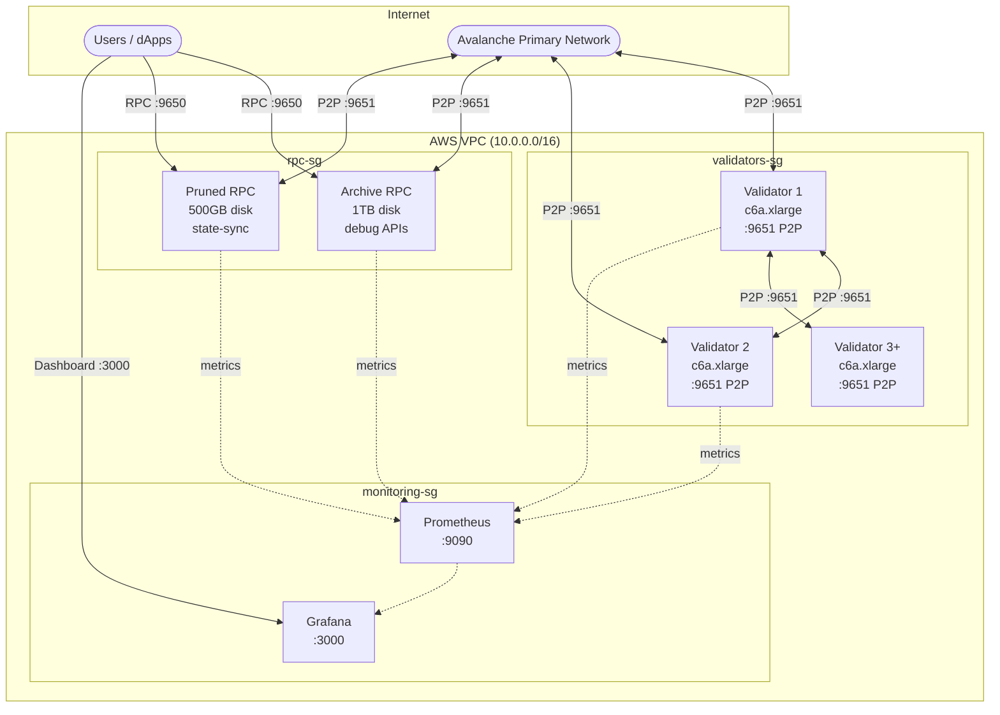

# L1 Blockchain Deployment Guide

Deploy a production-ready Avalanche L1 blockchain with validators, RPC nodes, and monitoring.

## Architecture



## Infrastructure Sizing

| Component | Instance | Disk | Purpose |
|-----------|----------|------|---------|
| Validators (5x) | c6a.xlarge | 500GB EBS | Block production, consensus |
| Archive RPC | c6a.xlarge | 1TB EBS | Full history, debug APIs, Blockscout |
| Pruned RPC | c6a.large | 500GB EBS | State-sync, transaction workloads |
| Monitoring | t3.small | 50GB EBS | Prometheus, Grafana |

**RPC Node Types:**

| Type | APIs | Pruning | State-Sync | Use Case |
|------|------|---------|------------|----------|
| Archive | Full (incl. debug/trace) | Disabled | Disabled | Block explorer, debugging, historical queries |
| Pruned | Standard (eth, net, web3) | Enabled | Enabled | Transaction submission, latest state queries |

## Step-by-Step Deployment

### Prerequisites

```bash
# macOS
brew install terraform ansible awscli jq go

# Or use make
make setup
```

### 1. Configure AWS & SSH

```bash
# Set AWS credentials
export AWS_ACCESS_KEY_ID="..."
export AWS_SECRET_ACCESS_KEY="..."

# Generate SSH key
ssh-keygen -t rsa -b 4096 -f ~/.ssh/avalanche-deploy -N ""
```

### 2. Configure Terraform

```bash
cd terraform/aws
cp terraform.tfvars.example terraform.tfvars
```

Edit `terraform.tfvars`:
```hcl
name_prefix       = "my-l1"
environment       = "fuji"
validator_count   = 5
rpc_archive_count = 1
rpc_pruned_count  = 1
ssh_public_key    = "ssh-rsa AAAA..."
ssh_private_key_file = "~/.ssh/avalanche-deploy"
enable_staking_key_backup = true
```

### 3. Create Infrastructure

```bash
make infra    # or: cd terraform/aws && terraform apply
```

### 4. Deploy Avalanchego

```bash
make deploy
make status   # Wait for "P:OK" on all nodes
```

### 5. Create Your L1

```bash
# Set your funded P-Chain private key
export AVALANCHE_PRIVATE_KEY="PrivateKey-ewoq..."

# Build and run create-l1 tool
make create-l1
./tools/create-l1/create-l1 \
  --network=fuji \
  --validators=$(cd terraform/aws && terraform output -json validator_ips | jq -r 'join(",")') \
  --chain-name=mychain \
  --output=l1.env
```

### 6. Configure Nodes for L1

```bash
source l1.env
make configure-l1 SUBNET_ID=$SUBNET_ID CHAIN_ID=$CHAIN_ID
make status
```

Your L1 is now running.

## Optional: Initialize Validator Manager

If your genesis includes a ValidatorManager proxy contract:

```bash
# Requires foundry
curl -L https://foundry.paradigm.xyz | bash && foundryup

# Set icm-contracts path
export ICM_CONTRACTS_PATH=~/code/icm-contracts

# Initialize
source l1.env
make initialize-validator-manager \
  SUBNET_ID=$SUBNET_ID \
  CHAIN_ID=$CHAIN_ID \
  CONVERSION_TX=$CONVERSION_TX \
  PROXY_ADDRESS=0x... \
  EVM_CHAIN_ID=99999
```

## Genesis Configuration

Use the **[Genesis Builder](https://build.avax.network/tools/l1-toolbox/create-chain)** to generate your `genesis.json` visually.

Key settings:
- `chainId` - Unique EVM chain ID ([check availability](https://chainlist.org/))
- `feeConfig` - Gas limits and base fees
- `warpConfig` - Cross-chain messaging (Avalanche Interchain Messaging)
- `alloc` - Pre-funded addresses

## Cost Estimate (AWS us-east-1)

| Component | Count | Monthly |
|-----------|-------|---------|
| Validators | 5 | ~$450 |
| Archive RPC | 1 | ~$120 |
| Pruned RPC | 1 | ~$65 |
| Monitoring | 1 | ~$15 |
| S3 + KMS | - | ~$1 |
| **Total** | | **~$651/mo** |

## Next Steps

- [Deploy add-ons](ADD-ONS.md) (Blockscout, faucet, eRPC, The Graph)
- [Operations guide](OPERATIONS.md) (upgrades, monitoring, health checks)
- [Troubleshooting](TROUBLESHOOTING.md)
