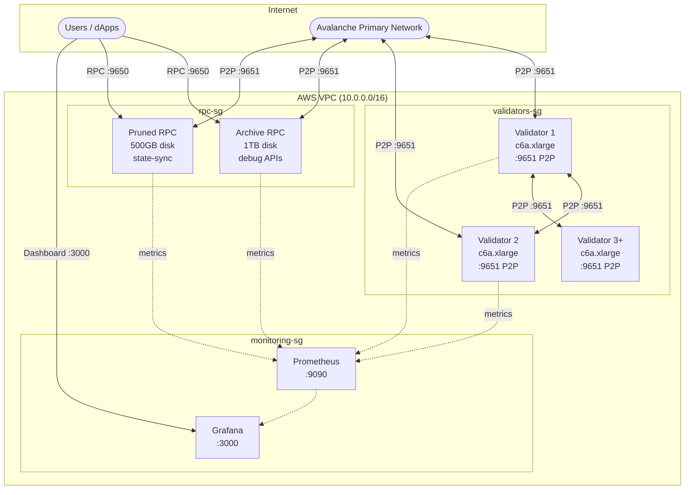

# L1 Blockchain Deployment Guide

Deploy a production-ready Avalanche L1 blockchain with validators, RPC nodes, and monitoring.

## Architecture



> This architecture diagram reflects the AWS topology with archive + pruned RPC split.
> GCP/Azure currently use a generic `rpc` pool.

## Infrastructure Sizing

| Component | Instance | Disk | Purpose |
|-----------|----------|------|---------|
| Validators (default: 3, common production: 5) | c6a.xlarge | 500GB EBS | Block production, consensus |
| Archive RPC | c6a.xlarge | 1TB EBS | Full history, debug APIs, Blockscout |
| Pruned RPC | c6a.large | 500GB EBS | State-sync, transaction workloads |
| Monitoring | t3.small | 50GB EBS | Prometheus, Grafana |

**RPC Node Types:**

| Type | APIs | Pruning | State-Sync | Use Case |
|------|------|---------|------------|----------|
| Archive | Full (incl. debug/trace) | Disabled | Disabled | Block explorer, debugging, historical queries |
| Pruned | Standard (eth, net, web3) | Enabled | Enabled | Transaction submission, latest state queries |

## Step-by-Step Deployment

### Prerequisites

```bash
# macOS
brew install terraform ansible awscli jq go shellcheck

# Or use make
make setup
```

### 1. Configure AWS & SSH

```bash
# Set AWS credentials
export AWS_ACCESS_KEY_ID="..."
export AWS_SECRET_ACCESS_KEY="..."

# Generate SSH key
ssh-keygen -t rsa -b 4096 -f ~/.ssh/avalanche-deploy -N ""
```

### 2. Configure Terraform

```bash
cd terraform/l1/aws
cp terraform.tfvars.example terraform.tfvars
```

Edit `terraform.tfvars`:
```hcl
name_prefix       = "my-l1"
environment       = "fuji"
validator_count   = 5
rpc_archive_count = 1
rpc_pruned_count  = 1
ssh_public_key    = "ssh-rsa AAAA..."
ssh_private_key_file = "~/.ssh/avalanche-deploy"
enable_staking_key_backup = true
```

#### Remote State (optional, recommended for teams)

By default Terraform keeps state in a local `terraform.tfstate` — fine for a
solo trial run, but it has no locking, isn't shared, and goes stale (we have
been bitten by applying against months-old local state from a destroyed
deployment). To switch this root to a shared S3 backend:

```bash
cd terraform/l1/aws
cp backend.tf.example backend.tf   # edit bucket/region/locking inside
terraform init -migrate-state      # copies existing local state into S3
```

Notes:

- **The S3 bucket must already exist.** Terraform must never create its own
  state bucket (some of our accounts deny `s3:CreateBucket` via SCP). Create
  it out-of-band with versioning + encryption, or reuse a shared one.
- **State locking:** on Terraform >= 1.10 use `use_lockfile = true` (S3-native,
  no extra infra). On older Terraform (this repo pins only `>= 1.5`) use a
  pre-existing DynamoDB table via `dynamodb_table`. The example file documents
  both.
- **Distinct `key` per root:** `l1/aws` and `primary-network/aws` must never
  share a state key. The example files already use distinct keys.
- **All operators must switch together.** Commit `backend.tf` once migrated;
  one operator on local state and another on S3 will clobber each other.
- Local state remains the default — without a `backend.tf`, nothing changes.

### 3. Create Infrastructure

```bash
make infra    # or: cd terraform/l1/aws && terraform apply
```

### 4. Deploy Avalanchego

```bash
make deploy
make status   # Wait for "P:OK" on all nodes
```

### 5. Create Your L1

> **Prerequisites:** the `platform` CLI is not installed by `make setup`. Install it with:
>
> ```bash
> go install github.com/ava-labs/platform-cli@latest
> ```
>
> (`go install` names the binary `platform-cli`; alias it to `platform`, or build from source with `go build -o platform .` as shown in the [platform-cli README](https://github.com/ava-labs/platform-cli).)
>
> **No extra tool needed:** you can skip platform-cli entirely and export your key directly — `export AVALANCHE_PRIVATE_KEY=0x...`. The tools accept raw hex or `PrivateKey-` CB58. Key precedence: `--key-name` > `AVALANCHE_PRIVATE_KEY` > keystore default.
>
> **Funding:** you need ~1.5+ AVAX on the Fuji P-Chain (1 AVAX per validator balance + fees) — fund via <https://core.app/tools/testnet-faucet> (C-Chain) then transfer C→P, or ask in the thread.

```bash
# Recommended key flow (platform-cli keystore)
platform keys import --name l1-deployer
platform keys default --name l1-deployer

# Build and run create-l1 tool
make create-l1
./tools/create-l1/create-l1 \
  --network=fuji \
  --key-name=l1-deployer \
  --validators=$(cd terraform/l1/aws && terraform output -json validator_ips | jq -r 'join(",")') \
  --chain-name=mychain \
  --output=l1.env
```

`l1.env` includes `SUBNET_ID`, `CHAIN_ID`, `CONVERSION_TX`, and `EVM_CHAIN_ID` (when `chainId` exists in your genesis file, default `configs/l1/genesis/genesis.json`).

### 6. Configure Nodes for L1

```bash
source l1.env
make configure-l1 SUBNET_ID=$SUBNET_ID CHAIN_ID=$CHAIN_ID
make status
```

This automatically deploys **eRPC** as a load balancer in front of your RPC nodes (auto-detected from `configs/l1/genesis/genesis.json`). To skip eRPC, add `SKIP_ERPC=true`.

Your L1 is now running:

- **Direct RPC**: `http://<rpc-ip>:9650/ext/bc/<chain-id>/rpc`
- **eRPC (recommended)**: `http://<monitoring-ip>:4000` — load balanced, cached, automatic failover
- **eRPC Health**: `http://<monitoring-ip>:4000/healthcheck`

## Optional: Initialize Validator Manager

If your genesis includes a ValidatorManager proxy contract:

```bash
# Requires foundry
curl -L https://foundry.paradigm.xyz | bash && foundryup

# Set icm-contracts path
export ICM_CONTRACTS_PATH=~/code/icm-contracts

# Initialize
source l1.env
make initialize-validator-manager \
  SUBNET_ID=$SUBNET_ID \
  CHAIN_ID=$CHAIN_ID \
  CONVERSION_TX=$CONVERSION_TX \
  PROXY_ADDRESS=0x... \
  EVM_CHAIN_ID=$EVM_CHAIN_ID
```

## Genesis Configuration

Use the **[Genesis Builder](https://build.avax.network/tools/l1-toolbox/create-chain)** to generate your genesis JSON visually, then save it at `configs/l1/genesis/genesis.json`.

Key settings:
- `chainId` - Unique EVM chain ID ([check availability](https://chainlist.org/))
- `feeConfig` - Gas limits and base fees
- `warpConfig` - Cross-chain messaging (Avalanche Interchain Messaging)
- `alloc` - Pre-funded addresses

## Cost Estimate (AWS us-east-1)

| Component | Count | Monthly |
|-----------|-------|---------|
| Validators | 5 | ~$450 |
| Archive RPC | 1 | ~$120 |
| Pruned RPC | 1 | ~$65 |
| Monitoring | 1 | ~$15 |
| S3 + KMS | - | ~$1 |
| **Total** | | **~$651/mo** |

## Kubernetes Alternative

This guide covers the Terraform + Ansible path. To deploy L1 infrastructure on an existing Kubernetes cluster instead, see the [Kubernetes deployment guide](../../kubernetes/README.md).

## Next Steps

- [Deploy add-ons](ADD-ONS.md) (Blockscout, faucet, The Graph, ICM Relayer)
- [Operations guide](../OPERATIONS.md) (upgrades, monitoring, health checks)
- [Troubleshooting](../TROUBLESHOOTING.md)
