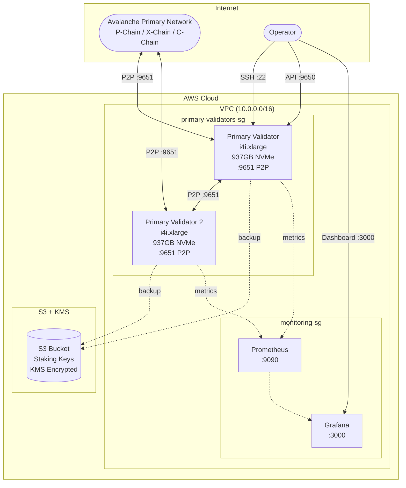
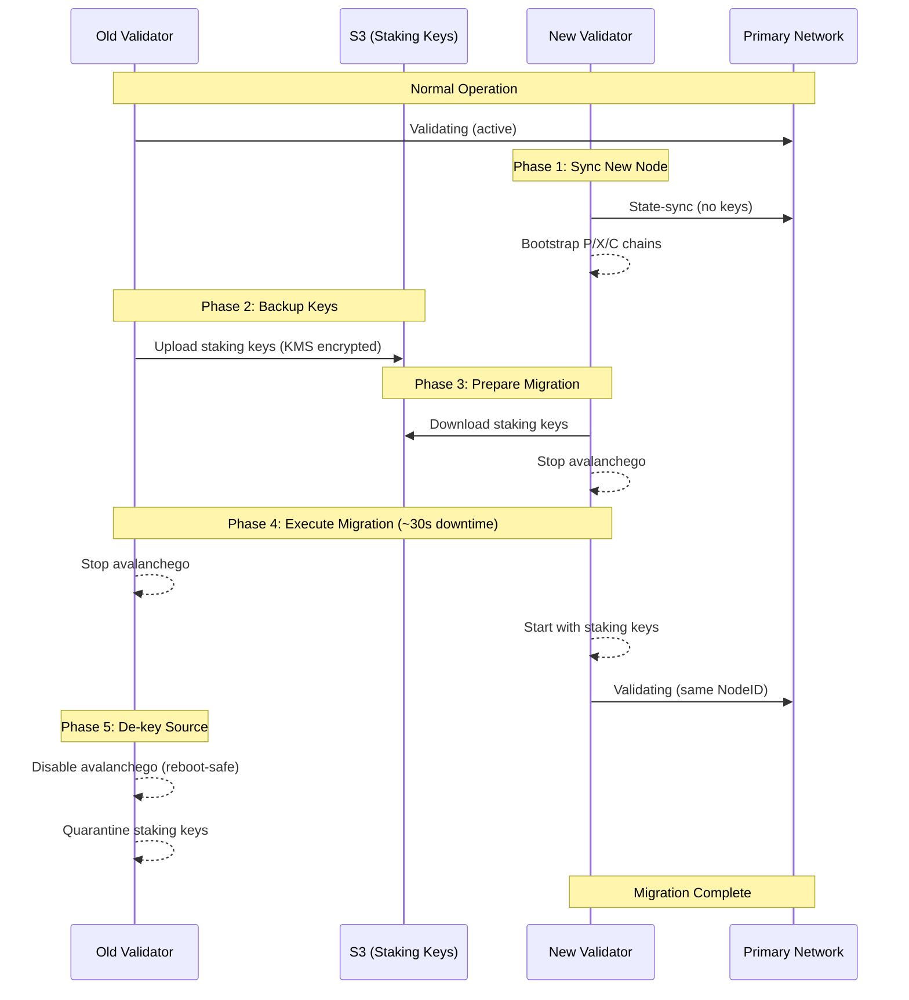

# Primary Network Validator Guide

Deploy and operate Avalanche Primary Network validators with enterprise-grade features.

> **Scope:** Primary Network workflows in this repo are currently supported on AWS only.

## Architecture



## Features

- **High-performance storage**: i4i.xlarge instances with 937GB NVMe
- **Staking key backup**: Automatic S3 backup with KMS encryption
- **Near-zero downtime migration**: Transfer validators to new instances
- **Database snapshots**: Fast bootstrapping for new nodes
- **Full chain sync**: Complete P/X/C chain data

## Quick Start

### 1. Create Infrastructure

```bash
make primary-infra CLOUD=aws
```

### 2. Deploy Validators

```bash
make primary-deploy CLOUD=aws NETWORK=fuji  # or mainnet
```

### 3. Wait for Sync

```bash
make primary-status CLOUD=aws
# Takes 2-4 hours for state-sync
```

### 4. Register on P-Chain

Use [Core Wallet](https://core.app/) or avalanche-cli to register your validator.

### 5. Backup Keys

```bash
make backup-keys CLOUD=aws
```

## Staking Key Management

```bash
# Backup all validator keys to S3
make backup-keys CLOUD=aws

# Restore keys to a specific node
make restore-keys CLOUD=aws SOURCE=primary-validator-1 TARGET_IP=10.0.1.50

# List backups
aws s3 ls s3://$(terraform -chdir=terraform/primary-network/aws output -raw staking_keys_bucket)/
```

## Database Snapshots

Create snapshots of synced nodes for faster bootstrapping:

```bash
# Create a snapshot from a synced validator
make create-snapshot CLOUD=aws NODE=primary-validator-1

# Create with custom name
make create-snapshot CLOUD=aws NODE=primary-validator-1 NAME=mainnet-2025-02

# List available snapshots
make list-snapshots CLOUD=aws

# Restore snapshot to a node
make restore-snapshot CLOUD=aws TARGET=migration-target
make restore-snapshot CLOUD=aws TARGET=migration-target SNAPSHOT=mainnet-2025-02

# Restore with integrity verification (recommended)
cd ansible && ansible-playbook -i inventory/aws_hosts playbooks/primary-network/restore-snapshot.yml \
  -e target_host=migration-target \
  -e verify_integrity=true
```

Snapshots are stored in S3 with KMS encryption and SHA256 checksums. A **pruned mainnet snapshot is ~400GB** and restores in minutes vs hours for state sync.

With `verify_integrity=true`, the snapshot is downloaded and its SHA256 verified **before** the old database is wiped — a missing or mismatched checksum is a hard failure, and the node restarts on its original database. To restore despite a lost checksum file (accepting the corruption risk), you must pass `-e skip_checksum_verification=true` explicitly. The default streaming mode is faster but performs **no** integrity check.

Restore failure semantics:

- **Failure before the database wipe** (download/verification stage): avalanchego is restarted on its original database and the run fails. The node is exactly as it was.
- **Failure after the wipe** (partial restore): the node is deliberately left **stopped** — it is never silently restarted onto a half-restored database. The failure output states the exact node state and the recovery options (re-run the restore, or wipe `db/` and start avalanchego to state-sync).

`create-snapshot.yml` always restarts avalanchego, even when archiving or upload fails (the run still exits red).

## Validator Migration

Migrate a validator to a new instance with minimal downtime (~30 seconds):



### Migration Steps

```bash
# 1. Add new instance to inventory as 'migration-target'

# 2. Prepare the new node
# Option A: Using snapshot (faster - minutes)
make prepare-migration CLOUD=aws NODE=migration-target SNAPSHOT=true

# Option B: Using state-sync (slower - hours)
make prepare-migration CLOUD=aws NODE=migration-target

# 3. Wait for sync to complete
./scripts/primary-network/check-sync.sh <new-node-ip>

# 4. Execute migration (~30s downtime)
make migrate-validator CLOUD=aws SOURCE=primary-validator-1 TARGET=migration-target
```

### Source De-keying (automatic)

After the NodeID is verified on the new node, the playbook **de-keys the source** so a reboot or EC2 auto-recovery can never resurrect a duplicate NodeID against the live validator:

- `avalanchego` is stopped **and disabled** on the source.
- The staking key directory is moved aside to a quarantine path (`staking.migrated-<timestamp>`, mode `0700`, key files `0600`) — preserved for rollback, but an accidental start would generate a brand-new NodeID instead of the migrated one.
- The end state is asserted (unit inactive + disabled, no avalanchego process, live staking dir absent), not just printed.

**Rollback** (move the validator back to the source): stop and disable avalanchego on the target first, then on the source `mv` the quarantine directory back to the staking path and `systemctl enable --now avalanchego`. Never run both nodes with the same keys simultaneously.

### Migration Failure Semantics

The source is always stopped **before** the target starts with the migrated keys, so no failure mode leaves both nodes running with the same NodeID. On any mid-migration failure, the rescue output states which node holds the authoritative keys and what to do next:

- **Failure while preparing the target** (key download/install): source is still running and authoritative; target is left stopped. Re-run after fixing.
- **Failure stopping the source**: source is authoritative; do not start the target until the source is confirmed stopped.
- **Failure starting the target after cutover**: target holds the authoritative keys; the source stays stopped. Fix the target, or roll back only after the target is fully stopped.
- **Failure during de-keying**: the migration succeeded (target is live); manually verify the source is stopped, disabled, and de-keyed before walking away.

## Cost Estimate

| Component | Instance | Storage | Monthly (us-east-1) |
|-----------|----------|---------|---------------------|
| Primary Validator | i4i.xlarge | 937GB NVMe | ~$310 |
| S3 + KMS | - | ~1GB | ~$1 |
| Monitoring | t3.small | 50GB | ~$15 |
| **Total per validator** | | | **~$326/mo** |

## Terraform Configuration

Edit `terraform/primary-network/aws/terraform.tfvars`:

```hcl
primary_validator_count = 1    # Number of Primary Network validators
enable_staking_key_backup = true  # S3 backup for staking keys
```

Primary validator runtime config is stored at:
`configs/primary-network/node/primary-validator-node-config.json`

### Remote State (optional, recommended for teams)

Local `terraform.tfstate` is the default. For shared/locking state, this root
ships an opt-in S3 backend example:

```bash
cd terraform/primary-network/aws
cp backend.tf.example backend.tf   # edit bucket/region/locking inside
terraform init -migrate-state
```

The bucket must pre-exist (never created by Terraform — some accounts deny
`s3:CreateBucket` via SCP), the `key` is distinct from the `l1/aws` root, and
all operators of a deployment must migrate together (commit `backend.tf`).
See the "Remote State" section in [docs/l1/DEPLOYMENT.md](../l1/DEPLOYMENT.md)
for full details, including the state-locking options per Terraform version.

## Kubernetes Alternative

This guide covers the Terraform + Ansible path (AWS). To deploy Primary Network nodes on an existing Kubernetes cluster instead, see the [Kubernetes deployment guide](../../kubernetes/README.md).

## Next Steps

- [Operations guide](../OPERATIONS.md) (upgrades, monitoring, health checks)
- [Troubleshooting](../TROUBLESHOOTING.md)
