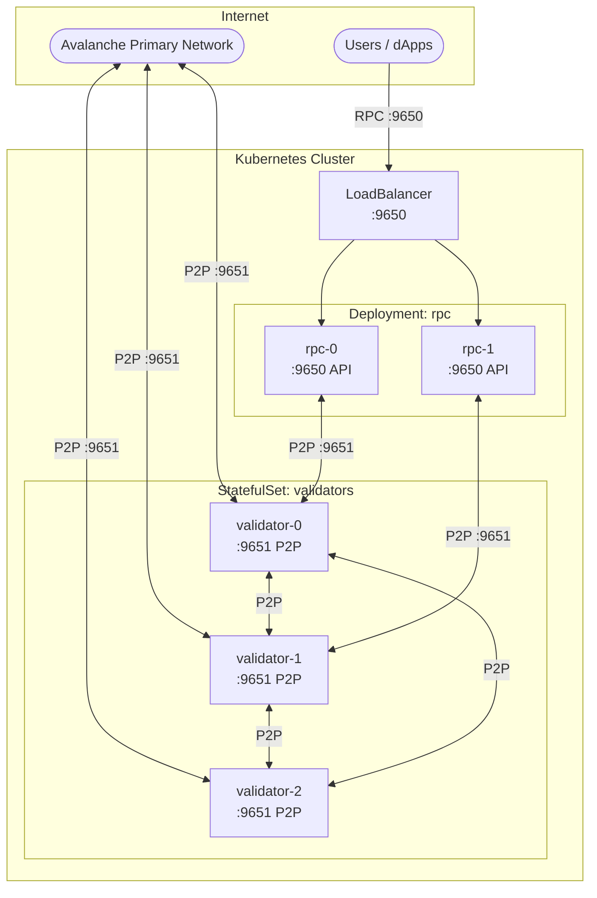

# Kubernetes Deployment

Deploy Avalanche L1 validators and RPC nodes on Kubernetes.

## Quick Start (Local Testing with kind)

```bash
# Install kind (Kubernetes in Docker)
brew install kind kubectl helm

# Create local cluster
./scripts/create-kind-cluster.sh

# Deploy validators
helm install validators ./helm/avalanche-validator \
  --set replicaCount=3 \
  --set network=fuji

# Wait for sync
./scripts/wait-for-sync.sh

# Create L1 (requires funded P-Chain key)
export AVALANCHE_PRIVATE_KEY="0x..."
./scripts/create-l1.sh --chain-name=mychain

# Configure validators for L1
./scripts/configure-l1.sh

# Check status
./scripts/status.sh
```

## Prerequisites

- `kubectl` configured to your cluster
- `helm` v3+
- For local testing: `kind` and `docker`
- Funded P-Chain address ([get test AVAX](https://build.avax.network/tools/faucet))

## Architecture



## Helm Charts

| Chart | Description |
|-------|-------------|
| `avalanche-validator` | StatefulSet for L1 validators |
| `avalanche-rpc` | Deployment for RPC nodes with LoadBalancer |
| `monitoring` | Grafana dashboard ConfigMap |

## Deployment Steps

### 1. Deploy Validators

```bash
helm install validators ./helm/avalanche-validator \
  --set replicaCount=3 \
  --set network=fuji \
  --set persistence.storageClass=gp3  # AWS EBS
```

### 2. Deploy RPC Nodes (Optional)

```bash
helm install rpc ./helm/avalanche-rpc \
  --set replicaCount=2 \
  --set network=fuji \
  --set service.type=LoadBalancer
```

### 3. Wait for P-Chain Sync

```bash
./scripts/wait-for-sync.sh
# Or manually:
kubectl exec -it validators-0 -- \
  curl -s localhost:9650/ext/info -X POST \
  -H 'content-type:application/json' \
  -d '{"jsonrpc":"2.0","id":1,"method":"info.isBootstrapped","params":{"chain":"P"}}'
```

### 4. Create L1

```bash
export AVALANCHE_PRIVATE_KEY="0x..."

# Option 1: Use the script
./scripts/create-l1.sh --chain-name=mychain --network=fuji

# Option 2: Run as K8s Job
kubectl apply -f jobs/create-l1-job.yaml
kubectl logs -f job/create-l1
```

### 5. Configure Validators for L1

```bash
# Get the L1 config
source l1.env

# Update validators with subnet tracking
./scripts/configure-l1.sh
```

### 6. Verify

```bash
./scripts/status.sh

# Or get RPC endpoint
kubectl get svc rpc-avalanche-rpc -o jsonpath='{.status.loadBalancer.ingress[0].hostname}'
```

## Configuration

### Validator Values

```yaml
# values-production.yaml
replicaCount: 5
network: mainnet

resources:
  requests:
    cpu: "8"
    memory: "32Gi"
  limits:
    cpu: "16"
    memory: "64Gi"

persistence:
  size: 1Ti
  storageClass: gp3

# Spread across availability zones
affinity:
  podAntiAffinity:
    requiredDuringSchedulingIgnoredDuringExecution:
      - labelSelector:
          matchLabels:
            app.kubernetes.io/name: avalanche-validator
        topologyKey: topology.kubernetes.io/zone
```

### Deploy with Custom Values

```bash
helm install validators ./helm/avalanche-validator -f values-production.yaml
```

## Local Testing with kind

### Create Cluster

```bash
./scripts/create-kind-cluster.sh
```

This creates a 4-node kind cluster with:
- 1 control plane
- 3 workers (one per validator)
- Port mappings for 9650 and 9651

### Limitations

- No real LoadBalancer (use NodePort or port-forward)
- Limited resources (reduce replica count if needed)
- Storage is ephemeral by default

### Access Services

```bash
# Port forward to RPC
kubectl port-forward svc/validators-avalanche-validator 9650:9650

# In another terminal
curl localhost:9650/ext/health
```

## Cleanup

```bash
# Delete releases
helm uninstall validators
helm uninstall rpc

# Delete kind cluster (local testing)
kind delete cluster --name avalanche-l1
```

## Troubleshooting

**Pods stuck in Pending**
```bash
kubectl describe pod validators-0
# Check for resource constraints or storage issues
```

**Nodes not syncing**
```bash
kubectl logs validators-0 -f
```

**Can't reach RPC endpoint**
```bash
# Check service
kubectl get svc

# For kind, use port-forward
kubectl port-forward svc/rpc-avalanche-rpc 9650:9650
```

---

## Genesis Configuration

Use the **[Genesis Builder](https://build.avax.network/tools/l1-toolbox/create-chain)** to generate your `genesis.json`, or copy the template from `../genesis.json`.

---

## Links

- [Genesis Builder](https://build.avax.network/tools/l1-toolbox/create-chain) - Generate genesis.json
- [Fuji Faucet](https://build.avax.network/tools/faucet) - Get test AVAX
- [Avalanche Docs](https://docs.avax.network/) - Official documentation
- [Main README](../README.md) - Terraform + Ansible deployment
