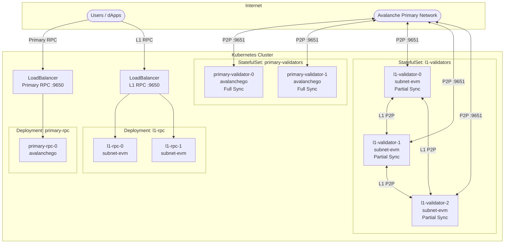

# Kubernetes Deployment

Deploy Avalanche Primary Network and L1 validators/RPC nodes on Kubernetes.

## Architecture Overview

This deployment supports two separate node types:

| Component | Image | Purpose | Storage |
|-----------|-------|---------|---------|
| **Primary Network** | `avaplatform/avalanchego` | P-Chain, X-Chain, C-Chain validation | 1TB (full history) |
| **L1 (Subnet)** | `avaplatform/subnet-evm_avalanchego` | L1/Subnet validation with partial sync | 500GB (partial sync) |

## Quick Start (Local Testing with kind)

```bash
# Install kind (Kubernetes in Docker)
brew install kind kubectl helm

# Create local cluster
./scripts/create-kind-cluster.sh

# Deploy L1 validators (with partial sync)
helm install l1-validators ./helm/avalanche-validator \
  --set l1_validator_replicas=3 \
  --set network=fuji

# Wait for sync
./scripts/wait-for-sync.sh

# Create L1 (requires funded P-Chain key)
export AVALANCHE_PRIVATE_KEY="0x..."
./scripts/create-l1.sh --chain-name=mychain

# Configure validators for L1
./scripts/configure-l1.sh

# Check status
./scripts/status.sh
```

## Prerequisites

- `kubectl` configured to your cluster
- `helm` v3+
- For local testing: `kind` and `docker`
- Funded P-Chain address ([get test AVAX](https://build.avax.network/tools/faucet))

## Architecture



## Helm Charts

| Chart | Description | Image |
|-------|-------------|-------|
| `primary-network-validator` | StatefulSet for Primary Network validators | `avaplatform/avalanchego` |
| `primary-network-rpc` | Deployment for Primary Network RPC nodes | `avaplatform/avalanchego` |
| `l1-validator` | StatefulSet for L1 validators (partial sync) | `avaplatform/subnet-evm_avalanchego` |
| `l1-rpc` | Deployment for L1 RPC nodes (partial sync) | `avaplatform/subnet-evm_avalanchego` |
| `monitoring` | Prometheus + Grafana with dashboards | - |

## Deployment Steps

### Option A: L1 Only (Recommended for Most Use Cases)

Deploy L1 validators with partial sync (only syncs P-Chain from Primary Network):

```bash
# Deploy L1 validators
helm install l1-validators ./helm/avalanche-validator \
  --set l1_validator_replicas=3 \
  --set network=fuji

# Deploy L1 RPC nodes
helm install l1-rpc ./helm/avalanche-rpc \
  --set l1_rpc_replicas=2 \
  --set network=fuji
```

### Option B: Full Infrastructure (Primary + L1)

Deploy both Primary Network and L1 infrastructure:

```bash
# 1. Deploy Primary Network validators (full sync - takes longer)
helm install primary-validators ./helm/primary-network-validator \
  --set primary_validator_replicas=2 \
  --set network=fuji

# 2. Deploy Primary Network RPC
helm install primary-rpc ./helm/primary-network-rpc \
  --set primary_rpc_replicas=2 \
  --set network=fuji

# 3. Deploy L1 validators (partial sync)
helm install l1-validators ./helm/avalanche-validator \
  --set l1_validator_replicas=3 \
  --set network=fuji

# 4. Deploy L1 RPC nodes
helm install l1-rpc ./helm/avalanche-rpc \
  --set l1_rpc_replicas=2 \
  --set network=fuji
```

### Wait for P-Chain Sync

```bash
./scripts/wait-for-sync.sh
# Or manually:
kubectl exec -it l1-validators-0 -- \
  curl -s localhost:9650/ext/info -X POST \
  -H 'content-type:application/json' \
  -d '{"jsonrpc":"2.0","id":1,"method":"info.isBootstrapped","params":{"chain":"P"}}'
```

### Create and Configure L1

```bash
export AVALANCHE_PRIVATE_KEY="0x..."

# Create L1
./scripts/create-l1.sh --chain-name=mychain --network=fuji

# Configure validators with subnet tracking
source l1.env
helm upgrade l1-validators ./helm/avalanche-validator \
  --set l1.enabled=true \
  --set l1.subnetId=$SUBNET_ID \
  --set l1.chainId=$CHAIN_ID
```

## Configuration Reference

### L1 Validator Values

```yaml
# L1 validators with partial sync
l1_validator_replicas: 3
network: fuji

l1_validator_image:
  repository: avaplatform/subnet-evm_avalanchego
  tag: "v1.14.1-v0.8.0"

l1_validator_resources:
  requests:
    cpu: "4"
    memory: "16Gi"
  limits:
    cpu: "8"
    memory: "32Gi"

l1_validator_persistence:
  size: 500Gi  # Smaller due to partial sync
  storageClass: gp3

l1_validator_config:
  partialSyncPrimaryNetwork: "P-Chain"  # Only sync P-Chain

l1:
  enabled: true
  subnetId: "..."
  chainId: "..."
```

### Primary Network Validator Values

```yaml
# Primary Network validators with full sync
primary_validator_replicas: 2
network: mainnet

primary_validator_image:
  repository: avaplatform/avalanchego
  tag: "v1.14.1"

primary_validator_resources:
  requests:
    cpu: "4"
    memory: "16Gi"
  limits:
    cpu: "8"
    memory: "32Gi"

primary_validator_persistence:
  size: 1000Gi  # Full Primary Network history
  storageClass: gp3
```

### Production Configuration

```yaml
# values-production.yaml for L1
l1_validator_replicas: 5
network: mainnet

l1_validator_resources:
  requests:
    cpu: "8"
    memory: "32Gi"
  limits:
    cpu: "16"
    memory: "64Gi"

l1_validator_persistence:
  size: 1Ti
  storageClass: gp3

# Spread across availability zones
l1_validator_affinity:
  podAntiAffinity:
    requiredDuringSchedulingIgnoredDuringExecution:
      - labelSelector:
          matchLabels:
            app.kubernetes.io/name: l1-validator
        topologyKey: topology.kubernetes.io/zone
```

## Monitoring

Deploy the monitoring stack with separate dashboards for Primary Network and L1:

```bash
helm install monitoring ./helm/monitoring
```

Dashboards:
- **Primary Network**: P-Chain height, C-Chain TPS, memory usage, peers
- **L1 Benchmark**: L1 TPS, block latency, gas metrics, verification time

Access Grafana:
```bash
kubectl port-forward svc/monitoring-grafana 3000:3000
# Open http://localhost:3000 (admin/admin)
```

## Local Testing with kind

### Create Cluster

```bash
./scripts/create-kind-cluster.sh
```

This creates a 4-node kind cluster with:
- 1 control plane
- 3 workers (one per validator)
- Port mappings for 9650 and 9651

### Limitations

- No real LoadBalancer (use NodePort or port-forward)
- Limited resources (reduce replica count if needed)
- Storage is ephemeral by default

### Access Services

```bash
# Port forward to L1 RPC
kubectl port-forward svc/l1-rpc-l1-rpc 9650:9650

# In another terminal
curl localhost:9650/ext/health
```

## Cleanup

```bash
# Delete releases
helm uninstall l1-validators
helm uninstall l1-rpc
helm uninstall primary-validators
helm uninstall primary-rpc
helm uninstall monitoring

# Delete kind cluster (local testing)
kind delete cluster --name avalanche-l1
```

## Troubleshooting

**Pods stuck in Pending**
```bash
kubectl describe pod l1-validators-0
# Check for resource constraints or storage issues
```

**Nodes not syncing**
```bash
kubectl logs l1-validators-0 -f
```

**Can't reach RPC endpoint**
```bash
# Check service
kubectl get svc

# For kind, use port-forward
kubectl port-forward svc/l1-rpc-l1-rpc 9650:9650
```

---

## Genesis Configuration

Use the **[Genesis Builder](https://build.avax.network/tools/l1-toolbox/create-chain)** to generate your `genesis.json`, or copy the template from `../genesis.json`.

---

## Links

- [Genesis Builder](https://build.avax.network/tools/l1-toolbox/create-chain) - Generate genesis.json
- [Fuji Faucet](https://build.avax.network/tools/faucet) - Get test AVAX
- [Avalanche Docs](https://docs.avax.network/) - Official documentation
- [Main README](../README.md) - Terraform + Ansible deployment
